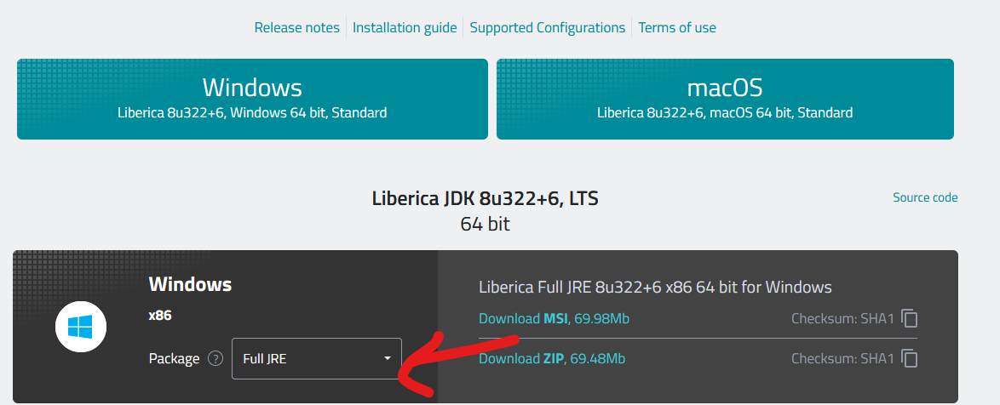
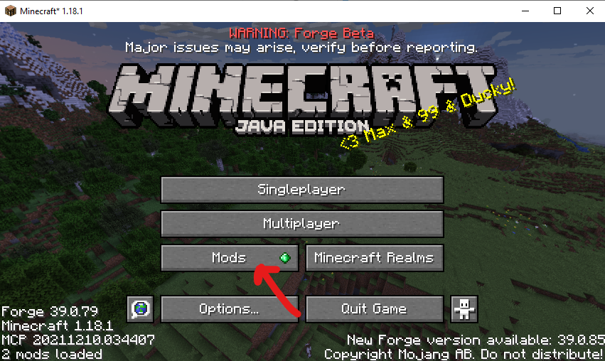

# Table of Contents <!-- omit in toc -->

- [1 Installing a launcher](#1-installing-a-launcher)
  - [1.1 JRE installation](#11-jre-installation)
  - [1.2 Installing the forge client](#12-installing-the-forge-client)
  - [1.3 Making the profile](#13-making-the-profile)
    - [Making profile](#making-profile)
    - [Select version](#select-version)
    - [Select directory](#select-directory)
- [2 Installing the mods](#2-installing-the-mods)
- [3 JVM Arguments - Important!](#3-jvm-arguments---important)
- [4 Joining the server](#4-joining-the-server)
# 1 Installing a launcher

Any launcher that you have installed already you can use, but if you don't know how to work with mods in these launchers I recommend installing [SKLauncher](https://skmedix.pl/sklauncher/downloads) because it will be the one that I will be using it for this walkthrough

## 1.1 JRE installation

After installing SKLauncher, you might run into this error

To resolve this, go to https://bell-sw.com/pages/downloads/#/java-8-lts, and scroll down to the downloads part, find the OS you are using and change the package from "Standard JDK" to "Full JDK"

Install this JDK, or alternatively, you can go to Oracles site to download JDK 8, though it will require you to make an account which sucks

After successful installation, you should see this

Change the option to offline mode, and you should be able to login with just a username 

## 1.2 Installing the forge client

Now that you have a launcher, you now need to install the client that will be used to run the mods

Inside the installed modpack folder, you should see a "client" folder, double click on the forge installer

Install the client and hope it doesn't throw any errors

## 1.3 Making the profile 

With forge installed, go back to SKLauncher and make a new profile that will be used for this modpack (you can can make different profiles for future modpacks you want to play in the future if you want)

### Making profile 
Make a new profile by first clicking on the plus button, this should bring you to a page where you change the name of the modpack, the directory and the version

###  Select version
First check that the forge client can be detected by the launcher, click on Version > Custom and you should see the Forge version listed, select it 

### Select directory
Then, click on the directory button and make a new folder in the current directory, name it whatever you want, here I named it "testing", don't mind the extra folders 

Select the new folder you made and you should see its directory listed in the window, add a name to your modpack and save it, in this example I will name my modpack "asdf"

Once finished, you should see the newly created profile on the the left, select it and click play, this will create the files needed for the launcher

# 2 Installing the mods

After you have clicked on play, you should see some text in the launcher log, and after a while, Minecraft will appear 

This may take a bit depending on how bad your system is so be patient (maybe around 5-15 mins max)

After that is done, a Minecraft window should appear that looks like this

If the information at the bottom is not present, then it's likely that you did not select Forge in the version window

Click on the mods folder, from there click on open mods folder

This window should appear in your file explorer, and is where you will drop your mods in (please ignore the folder name, I forgot to change it for this installation guide)

Inside the modpack folder, there should be a "Content" folder, drop all these mods into the previous "mods" folder 

Restart the client, you should see that the number of mods on the bottom left has changed, mods can vary since I have added clientside mods that are not in the folder 

(this means you can add your own mods if they are **clientside** and **compatible with forge**)

At this stage, you should be ready to play Minecraft on the server or on singleplayer, but you should first try to allocate ram if you have more than 4gbs of it, that way the game will run better

# 3 JVM Arguments - Important!

Close the client and go back to SKLauncher, Click on the 3 dots > Edit profile > Advanced Settings 

Usually you will need to change the memory usage in the JVM arguments, but forunately, this launcher allows you to just directly change the ram. You can keep it on auto, or give it around 2-4gbs of ram

After doing that, click "Save Profile", and launch the profile again

You are now ready to join the server

# 4 Joining the server

Click on multiplayer, and then click on add server

On the new screen, add the server IP address into the "Server Address" field, you can change the Server name to whatever you want, click done

You should see a new entry in the multiplayer tab, join the server, and you will be unable to join since you have yet to be whitelisted to the server.

At this point, you should ping Vielen when it's not 5am in SGT, so that I can whitelist you

You will now be able to play on the server, the fancy graphics in this screenshot are from shaders and are not included in the mods folder 

# Done :YogiriThumbsUp: <!-- omit in toc -->